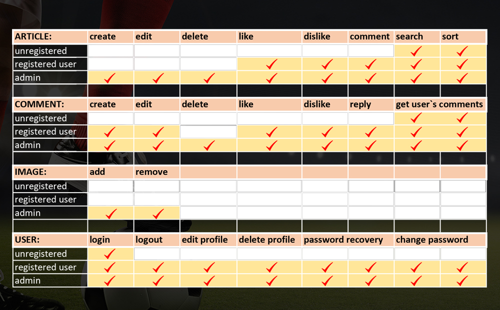

# IT Talents final project - [sportal.bg](https://github.com/hminkov/sportal.bg/blob/main/design/sportal_presentation.pdf)

Web based Java Application with a purpose of entertaiment for its users. It is created to keep the user up to date with the latest sport events of his favorite teams. Users can experience the web app either registrated where they can like, comment and share their oppinion with other or just like a regular viewer.

## A simple colaboration between two cadets: 
- _Hristo Minkov - 27yrs old - former architect - future Java developer_
- _Boris Peltekov - 27yrs old - former lawyer - future Java developer_

<jpg scr ="swagger/Article%20Controller.JPG" width="1000" height="200">

- link to our presentation - [sportal.bg](https://github.com/hminkov/sportal.bg/blob/main/design/sportal_presentation.pdf)

## Technologies and API`s: 
- _Java 15_
- _Spring Boot_
- _Spring Boot Validation_
- _Spring Boot Starter Email_
- _Spring Rest_
- _Hibernate_
- _JPA_
- _Lombok_
- _BCrypt_
- _MySQl_
- _Maven_
## Software: 
- _IntelliJ IDEA_
- _GiT_
- _Postman_
- _SQL Workbench_

## Design patterns: 
- _Singleton_
- _DAO (Data Access Object)_
- _DTO (Data Transfer Object)_
- _POJO (Plain Old Java Object)_

## Action Map: 

## Controllers: 
 
## MySQL ER Diagram: 

## Thank you for the attention!
